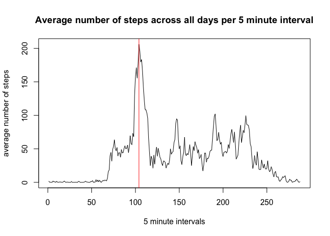

# Reproducible Research: Peer Assessment 1


## Loading and preprocessing the data

1. Load the data

```r
activity <- read.csv("activity.csv",stringsAsFactors=FALSE)
```
  
2. Preprocess the data

```r
activity$date <- as.Date(activity$date)
```

## What is mean total number of steps taken per day?

1. Histogram of the total number of steps taken each day


```r
steps.per.day <- tapply(activity$steps,activity$date,sum)
mean.steps.per.day <- mean(steps.per.day,na.rm=TRUE)
median.steps.per.day <- median(steps.per.day,na.rm=TRUE)
hist(steps.per.day)
```

 

2. The mean total number of steps taken per day is 1.0766189\times 10^{4}.  
The median total number of steps taken per day is 10765.

## What is the average daily activity pattern?

1. Plot the average number of steps taken across all days against the 5-minute interval.


```r
daily.activity <- tapply(activity$steps,activity$interval,mean,na.rm=TRUE)
max.interval <- which.max(daily.activity)
plot(daily.activity,type="l",xlab="5 minute intervals",ylab="average number of steps")
title(main="Average number of steps across all days per 5 minute interval")
abline(v=max.interval,col="red")
```

 

2. The maximum average number of steps occurs at interval 104.

## Imputing missing values

1. There are 2304 rows with missing values in the dataset.

2. We are going to impute the missing values with the average value for that interval.

3. Imputation in action:


```r
for (i in 1:nrow(activity)) {
  if (is.na(activity$steps[i])) {
    activity$steps[i] <- daily.activity[i%%288+1]
  }
}
```

4. Plot the histogram and calculate the mean and median for the total number of steps taken each day after the imputation.


```r
steps.per.day.2 <- tapply(activity$steps,activity$date,sum)
mean.steps.per.day.2 <- mean(steps.per.day.2,na.rm=TRUE)
median.steps.per.day.2 <- median(steps.per.day.2,na.rm=TRUE)
hist(steps.per.day.2)
```

 

The mean total number of steps taken per day is 1.0766189\times 10^{4}.  
The median total number of steps taken per day is 1.0766189\times 10^{4}.

We see that the new values of mean and median differ from the previous ones. This means that imputing missing values increases the values for mean and median as well as the maximum frequency in the histogram.

## Are there differences in activity patterns between weekdays and weekends?

1. Add a variable for weekday or weekend


```r
Sys.setlocale("LC_TIME","en_GB")
for (i in 1:nrow(activity)) {
  activity$weekpart[i] <- if (weekdays(activity$date[i]) %in% c("Saturday","Sunday")) {"weekend"} else {"weekday"}
}
```

2. Create a time series plot of the average number of steps taken versus the 5-minute interval split by weekday and weekend.


```r
library(ggplot2)
ggplot(activity,aes(interval,steps)) +
  geom_line() +
  facet_grid(weekpart ~ .) +
  labs(x="interval") +
  labs(y="number of steps")
```

 
